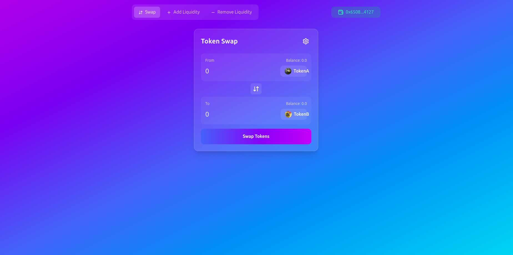
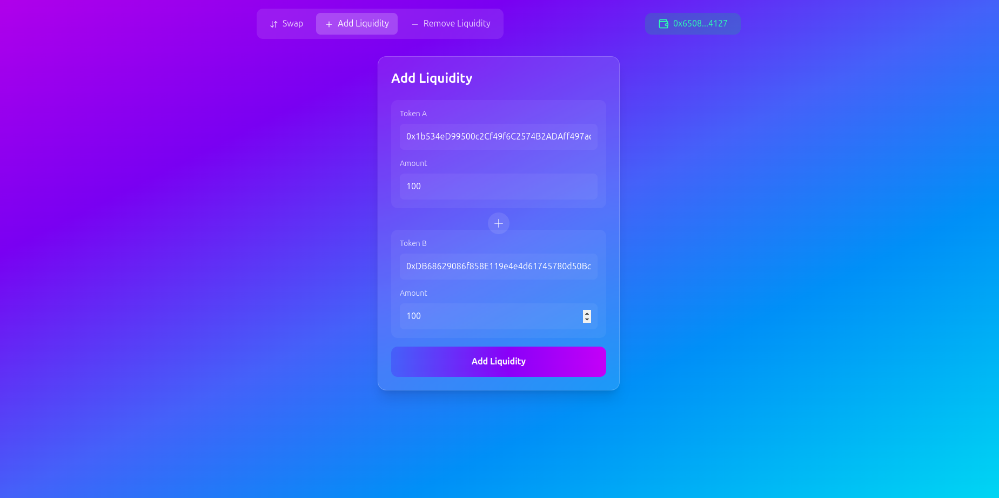
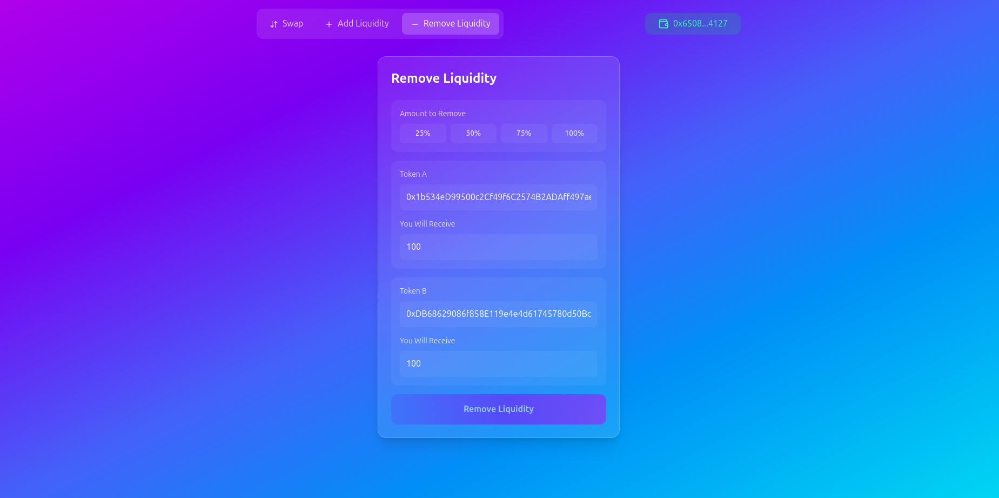

# **Peer2Play**

Peer2Play is a decentralized platform that facilitates peer-to-peer token swaps, liquidity provision, and seamless interaction with smart contracts via a user-friendly frontend.

---

## **Project Structure**

The project is divided into two main components:

1. **Contract**: Contains the Solidity smart contract implementation for liquidity management and token swaps.
   - Built and tested using **Foundry**.
2. **Frontend**: The React-based frontend for interacting with the smart contract.
   - Powered by **Vite** for fast builds and **ConnectKit/Wagmi** for wallet interaction.

---

## **Features**

- Add and remove liquidity for token pairs.
- Swap tokens seamlessly using decentralized pools.
- Fetch real-time token swap estimates.
- User-friendly interface for interacting with smart contracts.

---

## **Demo**

Attach screenshots or videos of the UI, transactions, and functionality in action. For example:

- Token swap interaction
- Liquidity addition
- Liquidity removal

### Example Screenshots:

**Swap Interface**


**Add Liquidity Management**


**Liquidity Management**



## Demo Video


---

## **Installation and Setup**

### Prerequisites
- **Node.js** (v16 or above)
- **Foundry** (for contract development)
- **PNPM**
- **Metamask** or any other Web3-compatible wallet.

---

### **Clone the Repository**
```bash
git clone https://github.com/iamnas/peer2play.git
cd peer2play
```

---

### **Contract Setup**

Navigate to the `Contract` folder:

```bash
cd Contract
```

1. **Install Foundry**
   If you haven't installed Foundry, you can do so with:
   ```bash
   curl -L https://foundry.paradigm.xyz | bash
   foundryup
   ```

2. **Install Dependencies**
   Run the following command to fetch dependencies:
   ```bash
   forge install
   ```

3. **Compile Contracts**
   Compile your smart contracts with:
   ```bash
   forge build
   ```

4. **Deploy Contracts**
   Update your deployment script with the desired network configuration (e.g., RPC URL, private key). Then deploy using:
   ```bash
   forge script script/Deploy.s.sol --rpc-url <RPC_URL> --private-key <PRIVATE_KEY> --broadcast
   ```

5. **Run Tests**
   You can run tests to ensure the contract works as expected:
   ```bash
   forge test
   ```

---

### **Frontend Setup**

Navigate to the `frontend` folder:

```bash
cd ../frontend
```

1. **Install Dependencies**
   ```bash
   pnpm install
   ```

2. **Environment Configuration**
   Create a `.env` file in the `frontend` folder with the following variables:
   ```plaintext
   VITE_PROJECT_ID=<Alchemy_Or_Infura_Project_ID>
   ```

3. **Start the Frontend**
   ```bash
   pnpm run dev
   ```

   The frontend will run locally on `http://localhost:5173`.

---

## **Usage**

### 1. **Add Liquidity**
- Navigate to the **Liquidity** tab.
- Select the token pair.
- Specify the amounts and confirm the transaction via Metamask.

### 2. **Swap Tokens**
- Go to the **Swap** tab.
- Select the input and output tokens.
- Enter the amount and confirm the transaction.

### 3. **Remove Liquidity**
- Under the **Liquidity** section, choose the token pair.
- Specify the liquidity to remove and confirm.

---

## **Smart Contract Details**

### Key Functions
- **addLiquidity**: Adds liquidity for a token pair.
- **removeLiquidity**: Removes liquidity and returns tokens to the user.
- **swapExactTokensForTokens**: Swaps an exact amount of tokens for another.
- **getAmountOut**: Calculates the output token amount for a given input.

---

## **Technologies Used**

### Backend (Smart Contracts)
- **Solidity**: Smart contract development.
- **Foundry**: Build, test, and deploy contracts efficiently.

### Frontend
- **React**: User interface.
- **Vite**: Fast build tool for the frontend.
- **ConnectKit & Wagmi**: Wallet connection and smart contract interaction.
- **Tailwind CSS**: Styling framework.

---

## **Contributing**

Feel free to fork the repository and create pull requests for any improvements or bug fixes. Contributions are welcome!

---

## **License**

This project is licensed under the [MIT License](LICENSE).

---

## **Contact**

For questions or support, connect with me:

- Twitter: [@0xnas_eth](https://twitter.com/0xnas_eth)
- GitHub: [@iamnas](https://github.com/iamnas)
